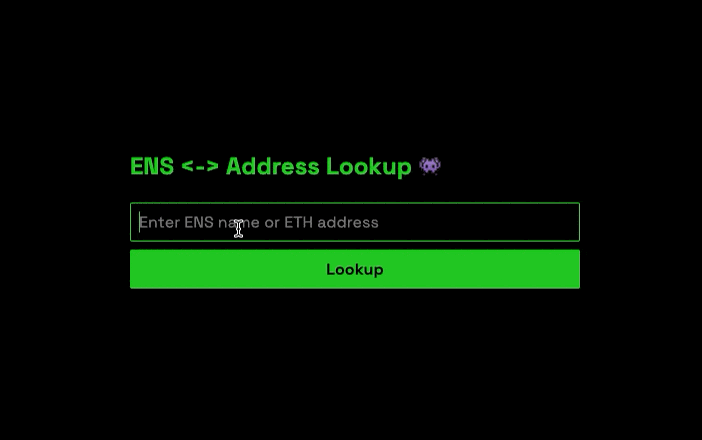

Application for looking up ENS names and addresses



## Features

* Forward lookup: ENS name → Ethereum address
* Reverse lookup: Ethereum address → ENS name

## Stack & Tools

* [ethers.js v6](https://docs.ethers.org/v6/) for blockchain interactions
* [Parcel v2](https://parceljs.org/) as the bundler/dev server
* Infura


## Getting Started

### Installation

1. Install dependencies:

   ```bash
   npm install
   ```

### Configuration

1. Create a `.env` file in the project root:

   ```ini
   INFURA_KEY=your_infura_project_id
   ```

### Run in Development

```bash
npm start
```

App will be available at `http://localhost:1234`.
